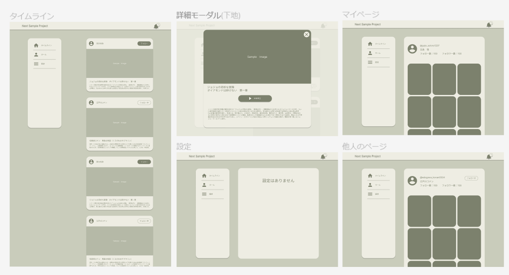
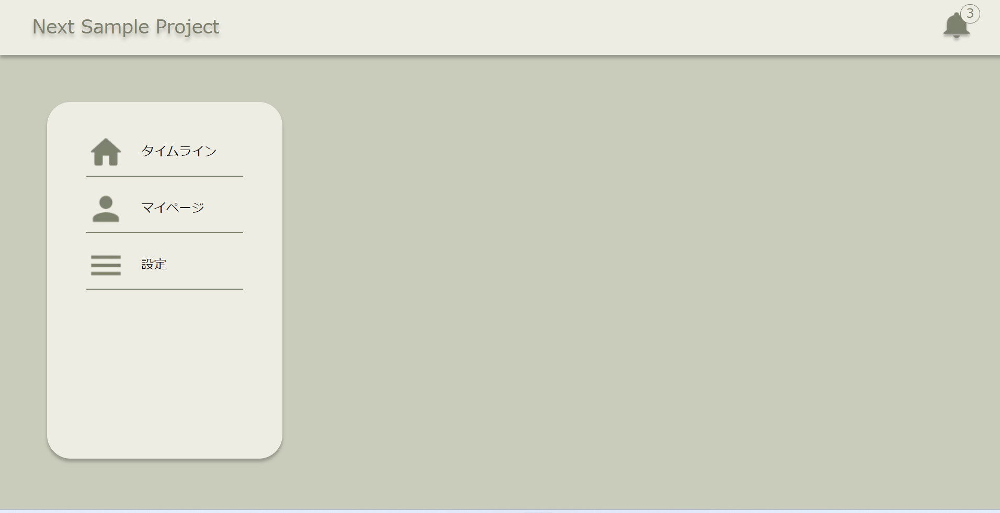

## サービスイメージ

[](https://www.figma.com/file/uidfvUXMcCISkmaeFNyYk2/Next-Sample?type=design&node-id=0%3A1&mode=design&t=graZE21KhL7JgrPY-1)

## 現状

[](https://next-sample-project-theta.vercel.app/)

## はじめ方

```bash
npm i
npm run dev
```

## 技術スタック

- 設計思想：atomic デザイン
- データフェッチ：axios
- 状態管理：recoil
- CSS：CSS モジュール
- コンポーネント管理：storybook
- インフィニティスクロール：react-infinite-scroller

## ページ

- タイムライン
  - インフィニティスクロール
- 詳細モーダル
- マイページ
  - 自分のレビュー
- 他人のページ
  - 他人のレビュー
